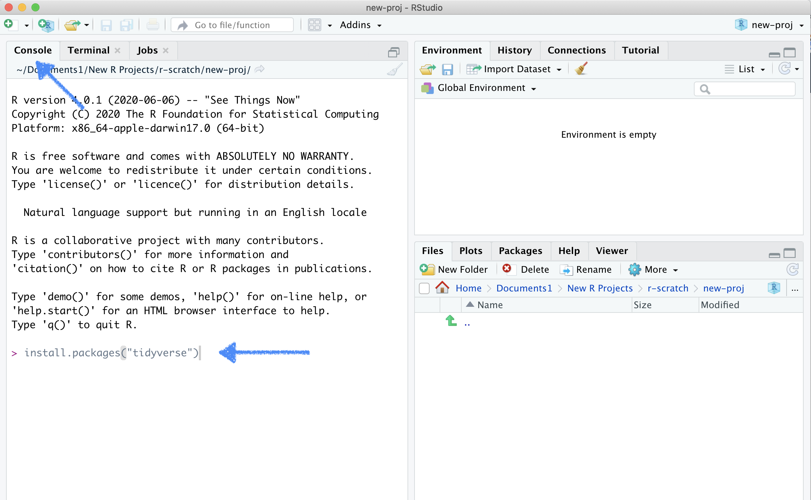

## Welcome!

This is the class website. Here you will find posted resources for each lesson. 

## Installing R and RStudio

Before we can get started we need to install **two** different software programs, R and RStudio. The software is 100% free.    

#### Start by installing R:

* Go to [cran.r-project.org](https://cran.r-project.org)
    + Windows users click **Download R for Windows** and on the next page **install R for the first time** and finally **Download R -4.3.1 for Windows**.
    + Mac users click **Download R for macOS** and on the next page pick the version matching the OS version you are using (for most users **R-4.3.1-x86_64.pkg** will be the right choice, unless you are working on a fancy new M1 or M2 mac in which case pick **R-4.3.1-arm64.pkg** instead).

#### Next we will install RStudio:

* Go to the [posit.co](https://posit.co/download/rstudio-desktop/) download page.
* Scroll down until you see a blue rectangle (to the right under the header *2: Install RStudio*) with the text **DOWNLOAD RSTUDIO DESKTOP FOR X** where X is the OS of the machine you are using. Click to download.   
* Alternatively, scroll down a bit more and find the right version of RStudio for your OS under the header **All Installers**.

## Installing the `tidyverse`

The tidyverse is a suite of packages that will allow us to use some of the most common data science tools used in R and RStudio. The tidyverse doesn't come built-in with R, so you'll need to install it by doing the following:

* Open up RStudio
* Copy and paste the following into the *Console* pane of RStudio (see the image below as a reference):
    `install.packages("tidyverse")` 
    

{width=90%}

\

* Press the Enter key to run this line of code
* When you've installed the package successfully, the console will fill up with some code that you don't have to worry about trying to read. It's just R confirming that the tidyverse is now downloaded.

 

Now you're all set for the first session!